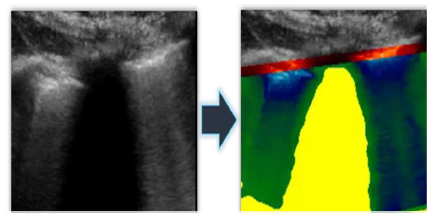
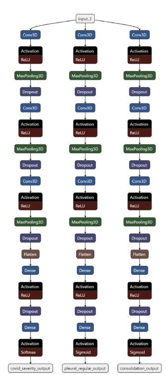

# Lung Ultrasound Classification

**Input**: Segmented LUS Videos with the shape of [20x200x200x2].

**Output**: 2 models (CNN and RFC).

##### Description:
The algorithm classifies a segmented LUS videos output which is received by the [PL_Seg_and_BB.py]() located in our _IPA project_, into multiple classes:
- `COVID-19 Severity`: [0,1,2,3], where 0 is very healthy and 3 is very sick.
- `Pleural-Line Regularity`: [0,1], where 0 is irregular, and 1 is regular.
- `Consolidation`: [0,1], where 0 is no consolidation, and 1 is appearance of consolidation.

Example of segmeneted frame of the input:

------------------------------------
Please follow the next steps in order to run our algorithm successfully:
##### Preprocessing Steps:
 1. **Environment** - Set up the environment according to [Deep.yml](./Deep.yml)
 2. **Videos dir** - Order all of the videos into a single folder.
 3. **GT Excel** - Create an Excel spreadsheet with corresponding GT labels of features.

##### Steps:
 4. **Data augmentation** - Run the [data_augmentation.py](./data_augmentation.py) file (with configuration set on data_augmentation), after entering the correct paths.
 5. **Videos splitting** - Run the [Split_video.py](./Split_video.py) file (with configuration set on Split_video), after entering the correct paths.
 6. **Main code** - Run the code [multi_outputs.py](./multi_outputs.py) (with configuration set to multi_outputs) in order to train the CNN and subsequent RFC, after entering the correct paths. (notice the option of changing frames resolution manually config)
 
##### Postprocessing Steps:
 - **class distribution plots**: Before training and after video loading, the class distribution plots should pop up in the browser (plotly graphs).
 - **scoring metrics**: After training, plots of the scoring metrics per epoch should pop up in the browser (plotly graphs), and confusion matrices should be plotted in the PyCharm SciView window.
 - **saved models**: Look in the folder and see the saved CNN and RFC models.

#### Net Architecture

#### Notes:
1. Dataloader was inefficient, so all of the videos are loaded onto the memory at the beginning. Therefore, the best way to tune
hyperparameters is to debug and set a breakpoint before the model assembly, subsequently running everything in the console.
2. Final `RFC` can be easily changed to any other ML classifier.
3. Frame-size in folder are 200x200, but can easily be changed to any other resolution by uncommenting the commented code-snippet in [multi_outputs.py]().
4. Batch size was a problem, and even with a better-than-middle class GPU (GeForce RTX 2060), the maximum batch size was 5 after resizing
the frame-size to 128x128.
5. The [data_augmentation.py](./data_augmentation.py) file can be changed in order to suit the needs of the database (more/less augmentation).
6. The [Split_video.py](./Split_video.py) file can be changed if we want more/less frames per video.
